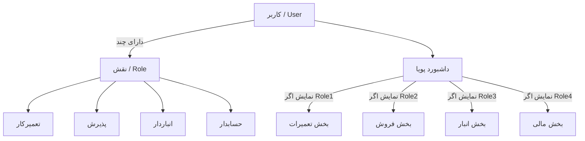
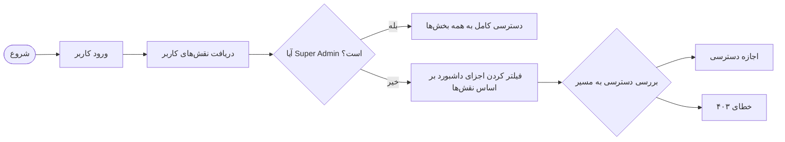

# مستندات سیستم مدیریت نقش‌های چندگانه (Multi-Role Management System)

این مستند شامل جزئیات فنی و راهنمای کاربری سیستم مدیریت نقش‌های چندگانه در سامانه پارس لیان است.

## ۱. معماری سیستم نقش‌بندی

سیستم بر پایه پکیج `spatie/laravel-permission` پیاده‌سازی شده است که از مدل RBAC (Role-Based Access Control) رابطه‌ای استفاده می‌کند.

### ساختار پایگاه داده
- `roles`: جدول تعریف نقش‌ها (admin, technician, receptionist, warehouse, accountant)
- `model_has_roles`: جدول واسط برای اختصاص چندین نقش به هر کاربر (مدل User)

### مدل کاربر (User Model)
متد `getRoleDisplayName()` در مدل `User` به‌روزرسانی شده تا تمامی نقش‌های اختصاص یافته به کاربر را به صورت رشته‌ای جدا شده با کاما نمایش دهد.

## ۲. کنترل دسترسی (Access Control)

### سطوح دسترسی
- **Super Admin**: دسترسی کامل به تمامی بخش‌های سیستم از جمله مدیریت کاربران و تنظیمات سیستمی.
- **Admin**: دسترسی به تمامی بخش‌های عملیاتی (اتوماسیون، فروش، انبار، حسابداری) اما **عدم دسترسی** به مدیریت کاربران.
- **کارمندان (Staff)**: دسترسی پویا بر اساس نقش‌های اختصاص یافته.

### میان‌افزار (Middleware)
از میان‌افزار `CheckRole` برای محافظت از مسیرها استفاده می‌شود. این میان‌افزار قابلیت پذیرش چندین نقش را دارد:
```php
Route::middleware(['auth', 'role:admin,technician'])->group(...)
```

## ۳. رابط کاربری (UI/UX)

### مدیریت کاربران
در صفحات ایجاد و ویرایش کاربر، فیلد انتخاب نقش از Dropdown به **Checkboxes** تغییر یافته است تا امکان انتخاب همزمان چندین نقش فراهم شود.

### داشبورد پویا
داشبورد اتوماسیون به صورت کامپوننت‌محور طراحی شده است. هر بخش (تعمیرات، فروش، مالی) تنها در صورتی نمایش داده می‌شود که کاربر حداقل یکی از نقش‌های مرتبط را داشته باشد.

## ۴. راهنمای مدیران

### اختصاص نقش به کارمند
۱. به بخش "مدیریت سیستم" و سپس "کاربران" بروید.
۲. بر روی "افزودن کاربر جدید" یا "ویرایش" کاربر فعلی کلیک کنید.
۳. در بخش "نقش‌های کاربر"، تیک نقش‌های مورد نظر را بزنید.
۴. تغییرات را ذخیره کنید.

### محدودیت مدیر سیستم (Admin)
مدیر سیستم (نقش `admin`) می‌تواند تمامی فرآیندهای کسب و کار را مدیریت کند اما به جهت امنیت، لیست کاربران و امکان تغییر نقش‌ها تنها در اختیار `super_admin` قرار دارد.

---

## ۵. نمودارهای سیستم

### نمودار معماری نقش‌ها (Mermaid)


### فلوچارت فرآیند تعیین دسترسی


## ۶. راهنمای توسعه‌دهندگان

### اضافه کردن نقش جدید
۱. ابتدا نقش را در دیتابیس (یا سیدر `RolesTableSeeder`) اضافه کنید.
۲. متد کمکی `isNewRole()` را در مدل `User.php` اضافه کنید.
۳. در `dashboard.blade.php` بخش مربوطه را با شرط `@if(auth()->user()->isNewRole())` احاطه کنید.
۴. در `web.php` نقش جدید را به آرایه میان‌افزار `role:` در مسیرهای مربوطه اضافه کنید.

---
*آخرین به‌روزرسانی: ۲۰۲۵-۱۲-۲۷*
