# مستندات ساختار نوار راهبری (Navigation Bar)

این سند شامل جزئیات پیاده‌سازی و ساختار منوی نوار راهبری سیستم پارس لیان است.

## ساختار درختی منو (Menu Tree Diagram)

ساختار منو بر اساس نقش‌های کاربری و دسترسی‌های تعریف شده در `User.php` به شرح زیر است:

```mermaid
graph TD
    Root[نوار راهبری]
    
    Dashboard[داشبورد]
    Root --> Dashboard
    
    %% مدیریت مشتریان
    Customers[مدیریت مشتریان]
    Root --> Customers
    Customers --> CustList[لیست مشتریان]
    Customers --> CustCreate[افزودن مشتری]
    
    %% مدیریت تعمیرات
    Repairs[مدیریت تعمیرات]
    Root --> Repairs
    Repairs --> RepList[لیست تعمیرات]
    Repairs --> RepTypes[انواع دستگاه]
    
    %% مدیریت انبار
    Inventory[مدیریت انبار]
    Root --> Inventory
    Inventory --> InvList[لیست کالاها]
    Inventory --> InvCreate[افزودن کالا]
    
    %% حسابداری و فروش
    Accounting[حسابداری و فروش]
    Root --> Accounting
    Accounting --> SalesList[لیست فروش]
    Accounting --> SalesCreate[ثبت فروش جدید]
    Accounting --> ServiceOrders[سفارشات سرویس]
    
    %% مدیریت پیامک
    SMS[مدیریت پیامک]
    Root --> SMS
    SMS --> SMSDash[داشبورد پیامک]
    SMS --> SMSLogs[تاریخچه پیامک‌ها]
    
    %% مدیریت سیستم (مخصوص ادمین)
    Admin[مدیریت سیستم]
    Root --> Admin
    Admin --> AdminDash[پنل مدیریت]
    Admin --> UserMgmt[مدیریت کاربران]
    Admin --> ProdMgmt[مدیریت محصولات]
    Admin --> CatMgmt[مدیریت دسته‌بندی‌ها]
```

## جزئیات پیاده‌سازی

### ۱. لایه اصلی (Layout)
تمام صفحات پنل مدیریت و اتوماسیون از فایل `layouts.admin` استفاده می‌کنند. این لایه شامل سایدبار (Sidebar) تعاملی و هدر است.

### ۲. نمایش بر اساس نقش (RBAC)
نمایش آیتم‌های منو در فایل `layouts.admin` با استفاده از متدهای مدل `User` کنترل می‌شود:
- `isSuperAdmin()`
- `isAdmin()`
- `isTechnician()`
- `isReceptionist()`
- `isWarehouse()`
- `isAccountant()`

### ۳. قابلیت واکنش‌گرایی (Responsive)
- در دسکتاپ: سایدبار به صورت ثابت در سمت راست نمایش داده می‌شود.
- در موبایل و تبلت: سایدبار مخفی شده و با کلیک بر روی آیکون منو (همبرگری) در هدر، به صورت کشویی (Slide-in) باز می‌شود.

### ۴. نشانگرهای بصری
- **آیکون‌ها**: از پکیج `Tabler Icons` استفاده شده است.
- **وضعیت فعال**: صفحه جاری با تغییر رنگ پس‌زمینه و متن در منو مشخص می‌شود.
- **Breadcrumbs**: مسیر جاری کاربر (مثلاً `پنل مدیریت > مدیریت کاربران`) در بالای صفحات نمایش داده می‌شود.

### ۵. میان‌برها (Shortcuts)
در هدر، دسترسی سریع به صفحات پرکاربرد مانند "ثبت مشتری جدید" و "ثبت سفارش" تعبیه شده است.
